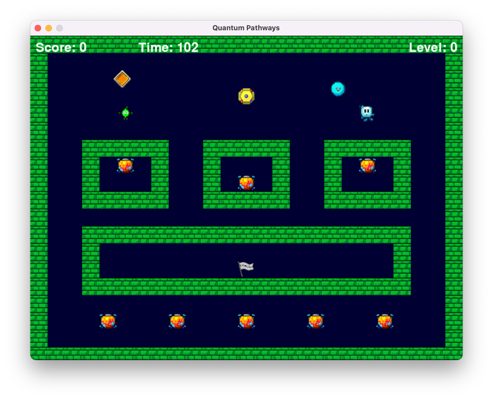

# Quantum Pathways

Quantum Pathways is a unique [AI-developed](#credits) quantum physics-inspired puzzle-platformer where you control Quarky, a quirky character with quantum abilities. Navigate through various levels, collecting special quantum quarks and using Quarky's abilities to overcome obstacles and reach the goal.



## Features

- Unique quantum physics-inspired gameplay mechanics
- Collect quantum quarks granting abilities such as quantum superposition, entanglement, and tunneling
- Time dilation feature to slow down time and make challenges more manageable
- Simple menu system and user interface with a timer and scoring system to track your progress
- A growing number of levels with increasing difficulty and complexity


## Installation

Quantum Pathways is available for Windows, macOS, and Linux. Please visit the [releases page](https://github.com/AI-Game-Makers/quantum-pathways/releases) to download the latest version. Alternatively, you can also build the game from source.

### Building from Source

#### Set up the Development Environment

1. Clone the repository or download the source code.

```bash
git clone https://github.com/AI-Game-Makers/quantum-pathways.git
cd quantum-pathways
```

2. Make sure you have Python 3.9 or later installed on your system. You can download Python from [python.org](https://www.python.org/downloads/). We recommend using a virtual environment to isolate the dependencies required by Quantum Pathways from other projects. You can create a virtual environment using the `venv` module that comes with Python. For example, the following commands create and activate a virtual environment named `venv`:

```bash
python3 -m venv venv
source venv/bin/activate
```

3. Install the required dependencies:
```bash
pip install -r requirements.txt
```

#### Run the Game

Navigate to the `quantum-pathways` directory and run the following command to start the game:

```bash
python main.py
```

If everything is set up correctly, you should see the game window open up and the main menu appear. The source code was tested using Python 3.9.6 on macOS 12.6.3 with `pygame==2.3.0`.

#### Build the Game

Quantum Pathways can be built into a standalone executable using [PyInstaller](https://www.pyinstaller.org/). To build the game, run the following command:

```bash
pyinstaller main.py --onefile --windowed --icon=assets/icon.ico
```

The executable will be located in the `dist` directory.

Alternatively, you can also build the game using the `install.sh` script. This script will create a virtual environment, install the required dependencies, and build the game.

To run the script, execute the following command:

```bash
./install.sh 1.0.0 platform
```

The first argument is the version number of the game, and the second argument is the platform for which the game is being built. The platform argument can be either `windows`, `macos` or `linux`.

The script will create an OS-specific executable with the name `quantum-pathways-v1.0.0-platform` in the `dist` directory. Please note that you can only build the game for the platform on which you are running the script.

## Development

Quantum Pathways is an open-source project, and we welcome contributions from the community. Feel free to fork the project, make changes, and submit pull requests. We're particularly interested in improvements to level design, gameplay mechanics, and graphics.

### Roadmap

We're actively working on improving Quantum Pathways and have plans to:

- Add more levels with increasing difficulty and complexity
- Implement enemies and NPC characters with AI-driven behaviors
- Integrate additional quantum concepts such as decoherence into the gameplay
- Enhance the graphics, sound effects, and overall immersion of the game

## License

This project is released under the [MIT License](LICENSE).

## Credits

Quantum Pathways was initially developed by [OpenAI's ChatGPT](https://openai.com/product/gpt-4), a highly capable AI language model, with the assistance of [@saifkhichi96](https://github.com/saifkhichi96). The entire game concept and 99% of the source code in [v1.0.0-alpha](https://github.com/AI-Game-Makers/quantum-pathways/releases/tag/v1.0.0-alpha) were generated by GPT-4, and all the graphics were created by [OpenAI's DALL-E](https://openai.com/product/dall-e-2), an image-generation AI using prompts written by ChatGPT.

The project showcases the power of AI-driven game design and the collaboration between humans and AI in creating unique and engaging experiences. To learn more about how the game was developed, [read this blog post](https://saifkhichi.com/blog/quantum-pathways/) or see the [transcript of the conversation between ChatGPT and Saif Khan](conversation.md) that led to the creation of the game.
